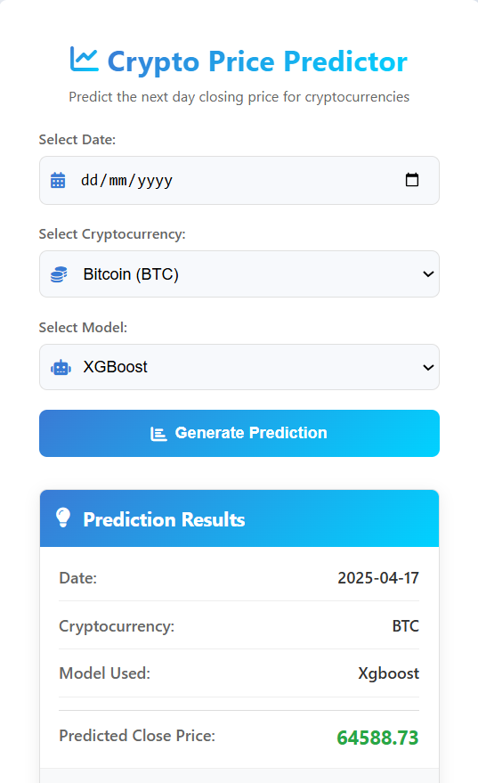

Crypto_Forecasting
==============================

A project to Forecast Close Price for both Bitcoin and Ethereum

Project Organization
------------

    ├── LICENSE
    ├── Makefile           <- Makefile with commands like `make data` or `make train`
    ├── README.md          <- The top-level README for developers using this project.
    ├── data
    │   ├── external       <- Data from third party sources.
    │   ├── interim        <- Intermediate data that has been transformed.
    │   ├── processed      <- The final, canonical data sets for modeling.
    │   └── raw            <- The original, immutable data dump.
    │
    ├── docs               <- A default Sphinx project; see sphinx-doc.org for details
    │
    ├── models             <- Trained and serialized models, model predictions, or model summaries
    │
    ├── notebooks          <- Jupyter notebooks. Naming convention is a number (for ordering),
    │                         the creator's initials, and a short `-` delimited description, e.g.
    │                         `1.0-jqp-initial-data-exploration`.
    │
    ├── references         <- Data dictionaries, manuals, and all other explanatory materials.
    │
    ├── reports            <- Generated analysis as HTML, PDF, LaTeX, etc.
    │   └── figures        <- Generated graphics and figures to be used in reporting
    │
    ├── requirements.txt   <- The requirements file for reproducing the analysis environment, e.g.
    │                         generated with `pip freeze > requirements.txt`
    │
    ├── setup.py           <- makes project pip installable (pip install -e .) so src can be imported
    ├── src                <- Source code for use in this project.
    │   ├── __init__.py    <- Makes src a Python module
    │   │
    │   ├── data           <- Scripts to download or generate data
    │   │   └── make_dataset.py
    │   │
    │   ├── features       <- Scripts to turn raw data into features for modeling
    │   │   └── build_features.py
    │   │
    │   ├── models         <- Scripts to train models and then use trained models to make
    │   │   │                 predictions
    │   │   ├── predict_model.py
    │   │   └── train_model.py
    │   │
    │   └── visualization  <- Scripts to create exploratory and results oriented visualizations
    │       └── visualize.py
    │
    └── tox.ini            <- tox file with settings for running tox; see tox.readthedocs.io


--------


# 🚀 Cryptocurrency Price Forecasting

A powerful machine learning application that predicts the next day's closing prices for Bitcoin and Ethereum using state-of-the-art algorithms.

## ✨ Features

- **Price Prediction**: Forecasts the next day's closing prices for Bitcoin and Ethereum
- **Multiple ML Models**: Implements Linear Regression and XGBoost algorithms
- **DVC Integration**: Complete data and model pipeline management for reproducibility
- **REST API**: Flask-based API for easy integration with other applications
- **User-friendly Interface**: Simple UI for quick predictions

## 📊 Project Overview

This project leverages machine learning to analyze historical cryptocurrency price data and generate accurate forecasts. The system has been trained on extensive historical data and uses feature engineering to capture market patterns and trends.



## 🧠 Models

The project implements two high-performing machine learning models:

1. **Linear Regression**: Simple yet effective for capturing linear relationships in price movements
2. **XGBoost**: Advanced gradient boosting algorithm that excels at capturing complex patterns

After extensive testing, these models demonstrated the highest predictive accuracy for cryptocurrency price forecasting.

## 🛠️ Technology Stack

- **Python**: Core programming language
- **Pandas & NumPy**: Data processing and manipulation
- **Scikit-learn & XGBoost**: Machine learning implementations
- **DVC**: Data Version Control for ML pipeline management
- **Flask**: API framework
- **Plotly/Matplotlib**: Data visualization

## 🚀 Getting Started

### Prerequisites

- Python 3.8+
- Git
- DVC

### Installation

1. Clone the repository:
   ```bash
   git clone https://github.com/fahimai001/CryptoCurrency-Forecasting
   cd Crypto-Forecasting


2. Create and activate a virtual environment:
python -m venv venv
# On Windows
venv\Scripts\activate
# On macOS/Linux
source venv/bin/activate


3. Install dependencies:
`pip install -r requirements.txt`

4. Pull the data and models using DVC:
`dvc pull`

# Running the Application
1. Start the Flask server:
    `python app.py`

2. Open your browser and navigate to:
    http://localhost:5000

# 🔄 DVC Pipeline

1. Data acquisition
2. Data preprocessing
3. Feature engineering
4. Model training
5. Model evaluation

To reproduce the pipeline:
    `dvc repro`

------------------------------------
Feel free to contribute